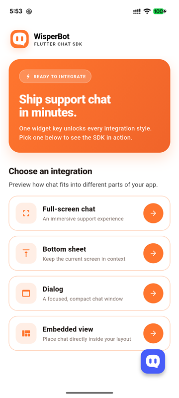
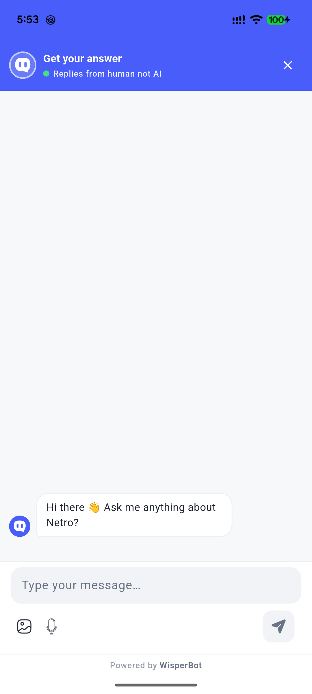
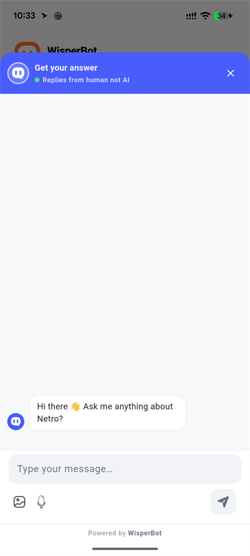
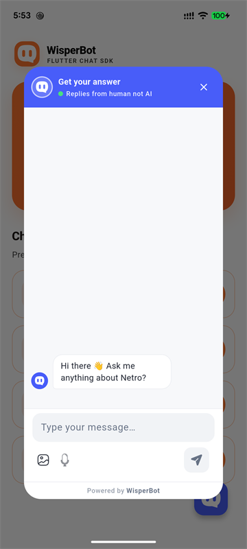
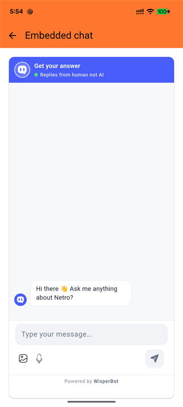

# Wisperbot chat


A customizable, battery-efficient Flutter SDK for embedding WisperBot customer support chat into mobile, web, and desktop apps. It provides identity-scoped visitor sessions, real-time messaging, foreground polling, prebuilt customizable UI, and push notifications.

---

## Capabilities & Platform Support

| Capability | Android / iOS | Web | macOS / Windows / Linux |
|---|:---:|:---:|:---:|
| **Anonymous & Signed-User Sessions** | ✅ Yes | ✅ Yes* | ✅ Yes |
| **OneSignal Push Notifications** | ✅ Yes | ✅ Yes | ✅ Yes |
| **Text, Image & Audio Messaging** | ✅ Yes | ✅ Yes | ✅ Yes |
| **Foreground Polling & Sync** | ✅ Yes | ✅ Yes | ✅ Yes |
| **Typing Indicators & Human Handoff** | ✅ Yes | ✅ Yes | ✅ Yes |
| **Prebuilt UI (Screens, Sheets, Dialogs, Launchers)** | ✅ Yes | ✅ Yes | ✅ Yes |
| **Required Pre-Chat Lead Forms** | ✅ Yes | ✅ Yes | ✅ Yes |

*\* Web secure storage requires HTTPS (or localhost during development) and is scoped to the browser origin.*

---

## Installation

Add the package to your `pubspec.yaml`:

```yaml
dependencies:
  wisperbot_chat: ^0.1.1
```

Or run:

```bash
flutter pub add wisperbot_chat
```

### Platform Requirements

* **Android**: Set `minSdk = 23` in `android/app/build.gradle` (required by `flutter_secure_storage`) and ensure `INTERNET` permission is granted:
  ```kotlin
  defaultConfig {
      minSdk = 23
  }
  ```
* **iOS & macOS**: Enable **Keychain Sharing** in Xcode and include a `keychain-access-groups` entitlement. The runnable [example](example/) contains the required configuration.
* **Web**: Deploy over HTTPS (browser session storage inherits the origin's security).

---

## Quick Start

Open a functional chat interface with just a few lines of code using your public **Widget Key**:

```dart
import 'package:flutter/material.dart';
import 'package:wisperbot_chat/wisperbot_chat.dart';

void openSupportChat(BuildContext context) async {
  final config = WisperBotConfig(widgetKey: 'YOUR_WIDGET_KEY');
  await WisperBotChat.open(context, config: config);
}
```

> [!NOTE]
> The `widgetKey` is a public routing identifier, not a secret. Never bundle WisperBot management credentials or widget secret keys in client applications.

---

## Integration Styles

WisperBot provides multiple ready-to-use presentation modes to fit seamlessly into any app workflow:

<p align="center">
  
</p>

### 1. Full Screen
An immersive, dedicated support page with app bar navigation:

```dart
Navigator.of(context).push(
  MaterialPageRoute<void>(
    builder: (_) => WisperBotChatScreen(config: config),
  ),
);
```

<p align="center">
  
</p>

### 2. Modal Bottom Sheet
Keeps the current screen in context while sliding up the chat interface:

```dart
await WisperBotChat.open(
  context,
  config: config,
  presentation: WisperBotPresentation.bottomSheet,
);
```

<p align="center">
  
</p>

### 3. Dialog Popup
A compact, centered chat window ideal for tablets, desktops, or web:

```dart
await WisperBotChat.open(
  context,
  config: config,
  presentation: WisperBotPresentation.dialog,
);
```

<p align="center">
  
</p>

### 4. Floating Launcher
An expandable floating action button that overlays your screen:

```dart
Stack(
  children: [
    const ApplicationContent(),
    WisperBotChatLauncher(config: config),
  ],
)
```

<p align="center">
  
</p>

### 5. Embedded View
Place the chat view directly inside an existing layout, drawer, or split-view:

```dart
WisperBotChatView(
  config: config,
  showHeader: true,
)
```

<p align="center">
  
</p>

### 6. Headless & Custom UI
Take full programmatic control with `WisperBotChatController`:

```dart
final client = WisperBotClient(config: config);
final controller = WisperBotChatController(client: client);

// Listen to state changes
final subscription = controller.states.listen((state) {
  print('Phase: ${state.phase}, Messages: ${state.messages.length}');
});

await controller.initialize();
await controller.sendText('Hello, I need help!');

// Cleanup
await subscription.cancel();
await controller.dispose();
await client.close();
```

---

## Configuration Reference

`WisperBotConfig` accepts the following options:

| Property | Type | Default | Description |
|---|---|---|---|
| `widgetKey` | `String` | *(required)* | Public routing identifier issued by the WisperBot dashboard. |
| `apiBaseUrl` | `String` | `'https://wisperbot.com'` | Base origin endpoint for widget API requests (`/widget/v1/*`). |
| `user` | `WisperBotUser?` | `null` | Visitor identity, profile data, and HMAC signature for verified users. |
| `theme` | `WisperBotThemeData?` | `null` | Presentation overrides for colors, bubble radius, spacing, and brightness. |
| `useApiColors` | `bool` | `true` | When true, applies the dashboard-configured branding palette automatically. |
| `presentation` | `WisperBotPresentation` | `WisperBotPresentation.fullScreen` | Default modal style (`fullScreen`, `bottomSheet`, or `dialog`) used by `WisperBotChat.open`. |
| `enableTyping` | `bool` | `true` | Whether the controller publishes throttled visitor typing updates. |
| `mediaAdapter` | `WisperBotMediaAdapter?` | `null` | Optional bridge for image selection and voice recording plugins. |
| `polling` | `WisperBotPollingConfig` | `const WisperBotPollingConfig()` | Intervals for active (`3s`), idle (`8s`), and failure backoff (`30s`) foreground polling. |
| `diagnostics` | `WisperBotDiagnosticsCallback?` | `null` | Callback receiving redacted operational metrics and lifecycle events. |
| `oneSignalAppId` | `String` | `WisperBotConfig.defaultOneSignalAppId` | OneSignal App ID used for push notification registration. |
| `enableOneSignal` | `bool` | `true` | Whether device push notification tokens are registered on session start. |

---

## Key Features

### 👤 Verified & Authenticated Users
To associate chat sessions with registered users in your application, provide a `WisperBotUser` along with an HMAC signature computed on your backend:

```dart
final config = WisperBotConfig(
  widgetKey: 'YOUR_WIDGET_KEY',
  user: WisperBotUser(
    externalId: signedInUser.id,
    name: signedInUser.displayName,
    email: signedInUser.email,
    signature: signatureFetchedFromYourBackend,
  ),
);
```

#### Switching Accounts & Logout
* **Switch user**: Call `controller.updateUser(newUser)` when switching accounts.
* **Logout**: Call `controller.updateUser(null)` on logout to wipe active credentials and clear local conversation state securely.

---

### 🎨 Colors & Theming
By default, the SDK uses the color palette configured in your WisperBot dashboard (`useApiColors: true`). 

To customize colors locally or use custom themes:

```dart
final config = WisperBotConfig(
  widgetKey: 'YOUR_WIDGET_KEY',
  useApiColors: false, // Disables server palette
  theme: const WisperBotThemeData(
    primaryColor: Color(0xFF087F5B),
    visitorBubbleColor: Color(0xFF087F5B),
    agentBubbleColor: Color(0xFFE9ECEF),
    borderRadius: 16.0,
  ),
);
```

---

### 🔔 Push Notifications
The SDK provides built-in OneSignal push notification integration so visitors receive notifications when agents reply.

Initialize notification handlers in `main()`:

```dart
final GlobalKey<NavigatorState> navigatorKey = GlobalKey<NavigatorState>();

Future<void> main() async {
  WidgetsFlutterBinding.ensureInitialized();

  final config = WisperBotConfig(
    widgetKey: 'YOUR_WIDGET_KEY',
    user: const WisperBotUser(name: 'Demo User', email: 'user@demo.com'),
  );

  WisperBotChat.initializeNotificationHandlers(
    config: config,
    navigatorKey: navigatorKey,
  );

  runApp(MyApp(navigatorKey: navigatorKey));
}
```
When a notification is tapped, the SDK automatically opens the chatbox.

---

### 📷 Media & Voice Attachments
To enable image picking and voice messaging buttons in the composer, supply a `WisperBotMediaAdapter` (e.g., wrapping `image_picker` and `record`):

```dart
final config = WisperBotConfig(
  widgetKey: 'YOUR_WIDGET_KEY',
  mediaAdapter: MyCustomMediaAdapter(),
);
```
*(See the [example](example/) app for a full reference implementation).*

---

### 📝 Pre-Chat Forms
When a widget requires pre-chat information (such as name or email), the built-in UI collects and submits the required fields automatically before initiating chat.

For headless integrations, submit manually via:
```dart
await controller.submitPreChat(
  const WisperBotPreChatData(name: 'Jane Doe', email: 'jane@example.com'),
);
```

---

## Delivery & Reliability Behavior

* **Platform Security**: Visitor tokens are bearer credentials persisted via `WisperBotSessionStore` using platform-native secure storage (`flutter_secure_storage`).
* **Authoritative Confirmation**: Messages transition from `pending` to `sent` only upon server receipt and ID issuance.
* **Network Failures & Unconfirmed State**: If a request disconnects or times out before receiving a response, the message is marked `unconfirmed` rather than failed, avoiding duplicate message sends.
* **Battery-Efficient Sync**: Foreground polling synchronizes replies and pauses automatically when the application is backgrounded or when chat is closed.
* **Safe Diagnostics**: Diagnostic callbacks emit strictly redacted operational telemetry (durations, error codes, HTTP statuses) without logging PII, bearer tokens, or message content.

---

## Development & Testing

```bash
# Get dependencies
flutter pub get

# Format code
dart format --output=none --set-exit-if-changed .

# Run static analysis
flutter analyze

# Run unit tests
flutter test
```

---

## License

This project is licensed under the MIT License - see the [LICENSE](LICENSE) file for details.
