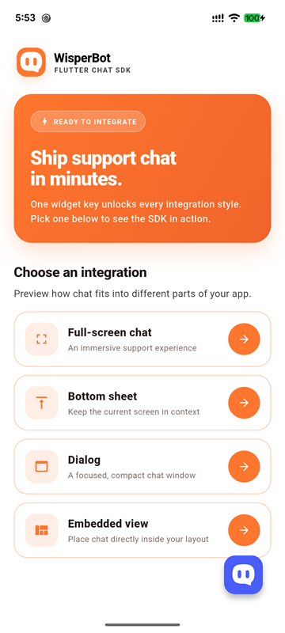
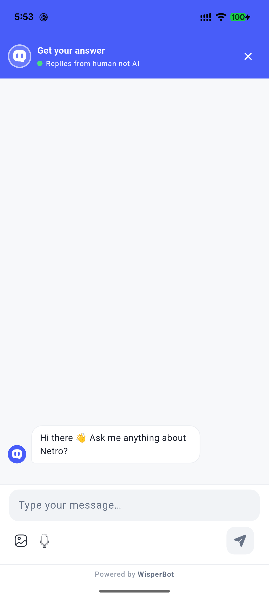
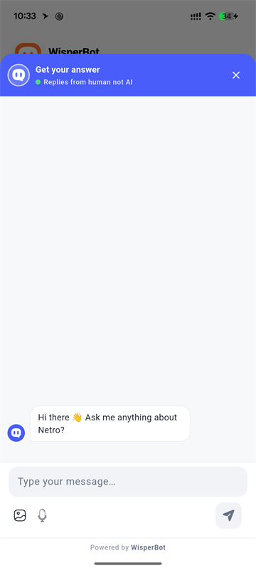
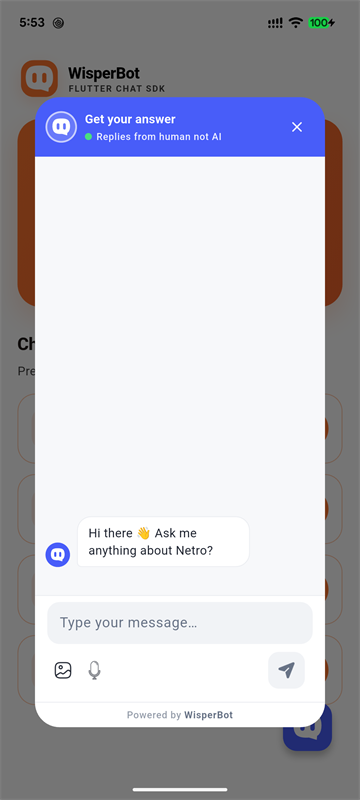
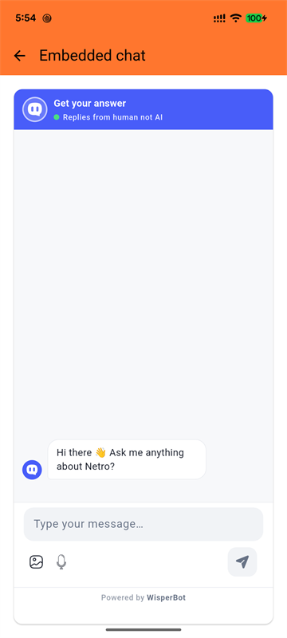

# WisperBot Chat


A customizable, battery-efficient Flutter SDK for embedding WisperBot customer support chat into mobile, web, and desktop apps. It provides identity-scoped visitor sessions, Pusher-powered real-time messaging, prebuilt customizable UI, and push notifications.

---

## Capabilities & Platform Support

| Capability | Android / iOS | Web | macOS / Windows / Linux |
|---|:---:|:---:|:---:|
| **Anonymous & Signed-User Sessions** | ✅ Yes | ✅ Yes* | ✅ Yes |
| **OneSignal Push Notifications** | ✅ Yes | ✅ Yes | ✅ Yes |
| **Text, Image & Audio Messaging** | ✅ Yes | ✅ Yes | ✅ Yes |
| **Pusher Realtime Sync** | ✅ Yes | ✅ Yes | ✅ Yes |
| **Typing Indicators & Human Handoff** | ✅ Yes | ✅ Yes | ✅ Yes |
| **Prebuilt UI (Screens, Sheets, Dialogs, Launchers)** | ✅ Yes | ✅ Yes | ✅ Yes |
| **Required Pre-Chat Lead Forms** | ✅ Yes | ✅ Yes | ✅ Yes |

*\* Web secure storage requires HTTPS (or localhost during development) and is scoped to the browser origin.*

---

## Installation

Add the package to your `pubspec.yaml`:

```yaml
dependencies:
  wisperbot_chat: ^0.2.0
```

Or run:

```bash
flutter pub add wisperbot_chat
```

### Platform Requirements

* **Android**: Set `minSdk = 23` in `android/app/build.gradle` (required by `flutter_secure_storage`) and ensure `INTERNET` permission is granted:
  ```kotlin
  defaultConfig {
      minSdk = 23
  }
  ```
* **iOS & macOS**: Enable **Keychain Sharing** in Xcode and include a `keychain-access-groups` entitlement. The runnable [example](example) contains the required configuration.
* **Web**: Deploy over HTTPS (browser session storage inherits the origin's security).

---

## Quick Start

Initialize WisperBot once using your public **Widget Key**:

```dart
import 'package:flutter/material.dart';
import 'package:wisperbot_chat/wisperbot_chat.dart';

// Optional: needed only for automatic navigation from notification taps.
final navigatorKey = GlobalKey<NavigatorState>();

Future<void> main() async {
  WidgetsFlutterBinding.ensureInitialized();

  await WisperBotChat.initialize(
    widgetKey: 'YOUR_WIDGET_KEY',
    oneSignalAppId: 'YOUR_ONESIGNAL_APP_ID',
    navigatorKey: navigatorKey,
  );

  // If your auth state already contains a signed-in user, call identify here
  // with its stable ID and real profile data before runApp().
  // await WisperBotChat.identify(...);

  runApp(MaterialApp(
    navigatorKey: navigatorKey,
    home: Scaffold(
      floatingActionButton: WisperBotChat.launcher(),
    ),
  ));
}
```

> [!NOTE]
> Use the **Mobile SDK key** from Widget Integrations for `widgetKey` (not the website embed key). It is a public routing identifier, not a secret. Never bundle WisperBot management credentials or widget secret keys in client applications.

---

## Integration Styles

WisperBot provides multiple ready-to-use presentation modes to fit seamlessly into any app workflow:



### 1. Full Screen
An immersive, dedicated support page with app bar navigation:

```dart
import 'package:flutter/material.dart';
import 'package:wisperbot_chat/wisperbot_chat.dart';

void openFullScreen(BuildContext context) {
  Navigator.of(context).push(
    MaterialPageRoute<void>(
      builder: (_) => WisperBotChat.screen(),
    ),
  );
}
```



### 2. Modal Bottom Sheet
Keeps the current screen in context while sliding up the chat interface:

```dart
import 'package:flutter/material.dart';
import 'package:wisperbot_chat/wisperbot_chat.dart';

Future<void> openBottomSheet(BuildContext context) async {
  await WisperBotChat.open(
    context,
    presentation: WisperBotPresentation.bottomSheet,
  );
}
```



### 3. Dialog Popup
A compact, centered chat window ideal for tablets, desktops, or web:

```dart
import 'package:flutter/material.dart';
import 'package:wisperbot_chat/wisperbot_chat.dart';

Future<void> openDialog(BuildContext context) async {
  await WisperBotChat.open(
    context,
    presentation: WisperBotPresentation.dialog,
  );
}
```



### 4. Floating Launcher
An expandable floating action button that overlays your screen:

```dart
import 'package:flutter/material.dart';
import 'package:wisperbot_chat/wisperbot_chat.dart';

Widget buildFloatingLauncher() {
  return Stack(
    children: [
      const Placeholder(), // Application content
      WisperBotChat.launcher(),
    ],
  );
}
```


When `useApiColors` is enabled, the launcher loads public dashboard widget
configuration before appearing. This is independent of
`registerVisitorOnAppLaunch`: disabling visitor registration still loads the
API color and placement without creating a visitor session.

The built-in launcher shows a dot while agent messages are unread. Wrap any
host-owned widget with `WisperBotChat.badge` to get the same behavior without
managing a listener:

```dart
WisperBotChat.badge(
  child: MyCustomChatButton(
    onPressed: () => WisperBotChat.open(context),
  ),
)
```

The floating launcher accepts the same kinds of badge customization directly:

```dart
WisperBotChat.launcher(
  badgeBackgroundColor: Colors.blue,
  badgeSmallSize: 10,
  badgeOffset: const Offset(2, -2),
  // badgeShowCount: true,
)
```

Opening the shared chat marks visible agent messages as read and updates the
badge automatically. It supports `backgroundColor`, `textColor`, `smallSize`,
`largeSize`, `alignment`, `offset`, `padding`, and `textStyle`. Set
`showCount: true` for a numeric badge, or provide `labelBuilder` for custom
badge content. Fully custom state handling can continue listening to
`WisperBotChat.unreadCount`. The default `registerVisitorOnAppLaunch: true` is
required to receive unread updates before the chat has been opened once.

When `showCount` is enabled, `largeSize` controls the labeled badge height;
`smallSize` applies only to dot badges. Counts from 1 through 99 are circular
by default; overflow text such as `99+` and custom labels expand into a pill.
Use a matching compact text style for small count badges:

```dart
WisperBotChat.badge(
  showCount: true,
  largeSize: 14,
  textStyle: const TextStyle(fontSize: 9, height: 1),
  child: const Icon(Icons.chat),
)
```

### 5. Embedded View
Place the chat view directly inside an existing layout, drawer, or split-view:

```dart
import 'package:flutter/material.dart';
import 'package:wisperbot_chat/wisperbot_chat.dart';

Widget buildEmbeddedChat() {
  return WisperBotChat.view(
    showHeader: true,
  );
}
```



### 6. Headless & Custom UI
Take full programmatic control with `WisperBotChatController`:

```dart
import 'package:wisperbot_chat/wisperbot_chat.dart';

Future<void> runHeadlessChat(WisperBotUser? user) async {
  final client = WisperBotClient(
    widgetKey: 'YOUR_WIDGET_KEY',
    user: user,
  );
  final controller = WisperBotChatController(client: client);

  // Listen to state changes
  final subscription = controller.states.listen((state) {
    print('Phase: ${state.phase}, Messages: ${state.messages.length}');
  });

  await controller.initialize();
  await controller.sendText('Hello, I need help!');

  // Cleanup
  await subscription.cancel();
  await controller.dispose();
  await client.close();
}
```

---

## Configuration Reference

`WisperBotChat.initialize` accepts the following configuration options:

| Property | Type | Default | Description |
|---|---|---|---|
| `widgetKey` | `String` | *(required)* | Public Mobile SDK key issued in Widget Integrations. |
| `apiBaseUrl` | `String` | `'https://wisperbot.com'` | Base origin for widget API and public launcher-configuration requests. |
| `theme` | `WisperBotThemeData?` | `null` | Presentation overrides for colors, bubble radius, spacing, and brightness. |
| `useApiColors` | `bool` | `true` | When true, applies the dashboard-configured branding palette automatically. |
| `lightStatusBarIcons` | `bool` | `false` | Uses white status-bar icons and text in full-screen chat. Enable it for dark or strongly colored headers. |
| `presentation` | `WisperBotPresentation` | `WisperBotPresentation.fullScreen` | Default modal style (`fullScreen`, `bottomSheet`, or `dialog`) used by `WisperBotChat.open`. |
| `enableTyping` | `bool` | `true` | Whether the controller publishes throttled visitor typing updates. |
| `mediaAdapter` | `WisperBotMediaAdapter?` | `null` | Optional bridge for image selection and voice recording plugins. |
| `diagnostics` | `WisperBotDiagnosticsCallback?` | `null` | Callback receiving redacted operational metrics and lifecycle events. |
| `oneSignalAppId` | `String?` | `null` | OneSignal App ID used for push notification registration. |
| `enableOneSignal` | `bool` | `true` | Whether device push notification tokens are registered on session start. |
| `requireNotificationPermission` | `bool` | `true` | Requires notification permission before chat starts on Android or iOS. |
| `registerVisitorOnAppLaunch` | `bool` | `true` | Registers visitor presence after the first app frame. When false, registration waits until chat opens. |
| `sessionStore` | `WisperBotSessionStore?` | `null` | Optional custom storage for identity-scoped session credentials. |
| `navigatorKey` | `GlobalKey<NavigatorState>?` | `null` | Enables automatic chat navigation when a push notification is tapped. Use the same key on your `MaterialApp` or `CupertinoApp`. |
| `onNotificationTapped` | `void Function(Map<String, dynamic>)?` | `null` | Optional callback that intercepts notification taps instead of automatic navigation. |
| `onForegroundNotification` | `void Function(Map<String, dynamic>)?` | `null` | Optional callback for notifications received while the app is in the foreground. |

---

## Migrating from 0.1.x

| Before | 0.2.0 |
|---|---|
| `WisperBotChat.initializeNotificationHandlers(...)` | `await WisperBotChat.initialize(...)` |
| `WisperBotChat.registerVisitor(...)` | Set `registerVisitorOnAppLaunch` (defaults to `true`) |
| `WisperBotConfig(user: user)` | Pass options to `initialize()`, then call `identify(user)` |
| `WisperBotLocation(...)` | Removed; use generic `customFields` only when required |
| Constructing or forwarding `WisperBotConfig` | Pass options directly to `initialize()` |

For advanced headless or multi-runtime applications, construct
`WisperBotClient` directly and provide its controller to a prebuilt widget.

---

## Key Features

### 🔗 Message Links

The prebuilt chat UI keeps message text selectable and makes `http://`,
`https://`, and `www.` links tappable. Links are underlined and opened through
the platform's external URL handler; `www.` addresses use HTTPS. Trailing
punctuation is excluded from the link target. If opening fails, the chat shows
"Could not open link."

---

### 👤 Verified & Authenticated Users
To associate the shared chat runtime with a registered user, call `identify`
after initialization with an HMAC signature computed on your backend:

```dart
import 'package:wisperbot_chat/wisperbot_chat.dart';

await WisperBotChat.identify(
  const WisperBotUser(
    externalId: 'user_123',
    name: 'John Doe',
    email: 'user@example.com',
    signature: 'backend_hmac_signature',
  ),
);
```

Use `externalId` as the stable identity. Names, email addresses, avatars, and
custom fields are profile attributes and can change. Do not call `identify`
with placeholder or randomly generated profile data: each distinct identity can
create a separate visitor in the dashboard.

If the real profile is available before `runApp`, identify it after
`initialize` and before `runApp`; this cancels pending anonymous registration.
If the profile loads later, use `registerVisitorOnAppLaunch: false`, then call
`identify` when the profile arrives. The launcher still loads API colors and
placement, while the visitor session remains deferred until chat opens.

#### Switching Accounts & Logout
* **Switch user**: Call `WisperBotChat.identify(newUser)` after the host application's authenticated user changes.
* **Logout**: Call `WisperBotChat.logout()` to wipe active credentials and clear local conversation state securely.
* **Headless runtime**: Pass `user` to `WisperBotClient`, or call `controller.updateUser`, when managing an explicit controller.
* **App shutdown**: Call `WisperBotChat.shutdown()` only when permanently tearing down or reconfiguring the shared SDK runtime. It disposes resources without deleting persisted session credentials.

---

### 🎨 Colors & Theming
By default, the SDK uses the color palette configured in your WisperBot dashboard (`useApiColors: true`). 

To customize colors locally or use custom themes:

```dart
import 'package:flutter/material.dart';
import 'package:wisperbot_chat/wisperbot_chat.dart';

await WisperBotChat.initialize(
  widgetKey: 'YOUR_WIDGET_KEY',
  useApiColors: false, // Disables server palette
  lightStatusBarIcons: true, // White status-bar content in full-screen chat
  theme: const WisperBotThemeData(
    primaryColor: Color(0xFF087F5B),
    visitorBubbleColor: Color(0xFF087F5B),
    agentBubbleColor: Color(0xFFE9ECEF),
    borderRadius: 16.0,
  ),
);
```

`lightStatusBarIcons` affects full-screen chat only. Leave it `false` for dark
status-bar content on light headers. Set it to `true` for white status-bar
content on dark or strongly colored headers.

---

### 🔔 Push Notifications
The SDK provides built-in OneSignal push notification integration so visitors receive notifications when agents reply.

To require notification permission before support chat starts on Android or iOS:

```dart
await WisperBotChat.initialize(
  widgetKey: 'YOUR_WIDGET_KEY',
  oneSignalAppId: 'YOUR_ONESIGNAL_APP_ID',
  requireNotificationPermission: true,
);
```

Tapping the launcher or calling `WisperBotChat.open` requests the native permission
prompt when notifications are disabled and the OS permits a request. Chat starts
only after permission is granted. If another prompt cannot be shown, a snackbar
says: "Enable notifications from settings to use the support feature."
After enabling notifications in settings, the user can tap chat again.
The launcher preloads visual widget configuration for API colors and placement,
but defers chat initialization and the notification permission prompt until
tapped when this option is enabled.
Direct screens, embedded views, and headless controllers enforce the same session
requirement; custom UI should handle `WisperBotErrorCode.notificationPermission`.
The option defaults to `true` and requires OneSignal to be enabled with an app ID. Set it to `false` when notification permission should not gate chat, including web integrations.
Open chat from a context with a `ScaffoldMessenger` to show the snackbar.

`WisperBotChat.initialize` installs notification handlers internally and uses
the supplied navigator to open chat from a notification:

```dart
import 'package:flutter/material.dart';
import 'package:wisperbot_chat/wisperbot_chat.dart';

final navigatorKey = GlobalKey<NavigatorState>();

Future<void> main() async {
  WidgetsFlutterBinding.ensureInitialized();
  await WisperBotChat.initialize(
    widgetKey: 'YOUR_WIDGET_KEY',
    oneSignalAppId: 'YOUR_ONESIGNAL_APP_ID',
    navigatorKey: navigatorKey,
    onForegroundNotification: (payload) {
      // Optional host-specific foreground handling.
    },
  );

  runApp(MaterialApp(
    navigatorKey: navigatorKey,
    home: const Scaffold(),
  ));
}
```
When a notification is tapped, the SDK automatically opens the chatbox.

Foreground notifications do not display SDK SnackBars. Pass
`onForegroundNotification` to `initialize` for custom handling, or
`onNotificationTapped` to override automatic navigation for tapped pushes.

---

### 📷 Media & Voice Attachments
The prebuilt composer includes image picking, document picking, and voice recording
using the SDK's built-in media adapter. No custom adapter is needed:

```dart
import 'package:wisperbot_chat/wisperbot_chat.dart';

await WisperBotChat.initialize(
  widgetKey: 'YOUR_WIDGET_KEY',
);
```
The app must provide the platform permission declarations for the media features
it uses, including iOS photo-library and microphone usage descriptions. See the
[example](example) app for platform setup.

`mediaAdapter` is an optional override for apps that need custom picker or recording
behavior. Most integrations should leave it unset.

---

### 📝 Pre-Chat Forms
When a widget requires pre-chat information (such as name or email), the built-in UI collects and submits the required fields automatically before initiating chat.

For headless integrations, submit manually via:
```dart
import 'package:wisperbot_chat/wisperbot_chat.dart';

Future<void> submitLead(WisperBotChatController controller) async {
  await controller.submitPreChat(
    const WisperBotPreChatData(name: 'Jane Doe', email: 'jane@example.com'),
  );
}
```

---

## Delivery & Reliability Behavior

* **Platform Security**: Visitor tokens are bearer credentials persisted via `WisperBotSessionStore` using platform-native secure storage (`flutter_secure_storage`).
* **Authoritative Confirmation**: Messages transition from `pending` to `sent` only upon server receipt and ID issuance.
* **Network Failures & Unconfirmed State**: If a request disconnects or times out before receiving a response, the message is marked `unconfirmed` rather than failed, avoiding duplicate message sends.
* **Realtime Sync**: A private Pusher channel delivers messages, typing changes, and handoff updates while chat is active, and disconnects automatically in the background or when chat is closed. Pull-to-refresh remains available as a user-triggered consistency check, and full initial history is loaded through bounded pagination; neither path runs on a timer.
* **Safe Diagnostics**: Diagnostic callbacks emit strictly redacted operational telemetry (durations, error codes, HTTP statuses) without logging PII, bearer tokens, or message content.

---

## Development & Testing

```bash
# Get dependencies
flutter pub get

# Format code
dart format --output=none --set-exit-if-changed .

# Run static analysis
flutter analyze

# Run unit tests
flutter test
```

---

## License

This project is licensed under the MIT License - see the [LICENSE](LICENSE) file for details.
